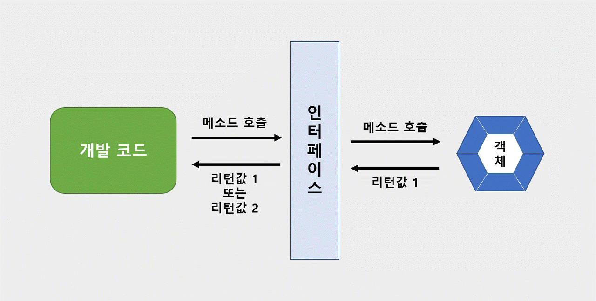

# 20230525

---

## 인터페이스



- 개발코드는 인터페이스를 호출하고 인터페이스는 객체를 호출해 나온 리턴값을 개발 코드에게 전달한다.
- 개발 코드와 객체 간의 직접적인 호출이 더욱 간단하다.

### 그럼에도 인터페이스를 거치는 이유


- 객체 B라는 새로운 객체를 생성해냈을 때 상황
    - 개발 코드는 객체 A든 B든 관계 없이 인터페이스 만을 사용하기에 유지보수면에서 간단하다!

### 인터페이스를 이용하여 TV를 켜는 코드

```java
public interface RemoteControl{
	public void turnOn();
}

public class Television implements RemoteContrl{
	@Override
	public void turnOn(){
		System.out.println("TV를 켭니다.");
	}
}

public static void main(String[] args) {
	RemoteContrl rc = new Television();

	rc.turnOn();
}
//결과값 : TV를 켭니다.
```

### 인터페이스를 이용하여 Audio를 켜는 코드

```java
public class Audio implements RemoteContrl{
	@Override
	public void turnOn(){
		System.out.println("Audio를 켭니다.");
	}
}

public static void main(String[] args) {
	RemoteContrl rc = new Television();
	rc = new Audio();

	rc.turnOn();
}
//결과값 : Audio를 켭니다.
```

- 인터페이스 사용시 객체를 Audio로 교체할 때 `rc = new Audio();` 코드 하나로 Audio를 켜는 코드로 간단히 변경이 가능하다!