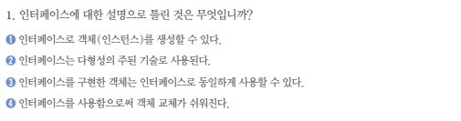

# 20230602

---

## 8장 확인문제



- 1번 : 인터페이스는 상수와 메서드 만이 존재한다


- 3번 : 재정의 가능하다. 재정의 할 시, default를 public으로 수정한 뒤 재정의 하면 된다.


- 4번 : 구현 객체를 인터페이스 타입으로 변환 시 자동 타입 변환이 된다.


- 1,2,3,4 번


```java
public class TV implements Remocon {
	@Override
	public void powerOn(){
		System.out.println("TV를 켰습니다.");
	}
}
```


```java
//Cat.java
public class Cat implements Soundable {
	@Override
	public string sound(){
		String catSound = "야옹";
		return catSound;
}
//Dog.java
public class Dog implements Soundable {
	@Override
	public string sound(){
		String dogSound = "멍멍";
		return dogSound;
}
```


```java
//DataAccessObject.java
public interface DataAccessObject {
	void select();
	void insert();
	void update();
	void delete();
}

//OracleDao.java
public class OracleDao implements DataAccessObject{
	@Override
	public void select() {
		System.out.println("Oracle DB에서 검색");
	}
	@Override
	public void insert() {
		System.out.println("Oracle DB에서 삽입");
	}
	@Override
	public void update() {
		System.out.println("Oracle DB에서 수정");
	}
	@Override
	public void delete() {
		System.out.println("Oracle DB에서 삭제");
	}

//MySqlDao.java
public class MySqlDao implements DataAccessObject{
	@Override
	public void select() {
		System.out.println("MySql DB에서 검색");
	}
	@Override
	public void insert() {
		System.out.println("MySql DB에서 삽입");
	}
	@Override
	public void update() {
		System.out.println("MySql DB에서 수정");
	}
	@Override
	public void delete() {
		System.out.println("MySql DB에서 삭제");
	}
```


```java
if( a instanceof C )
```
