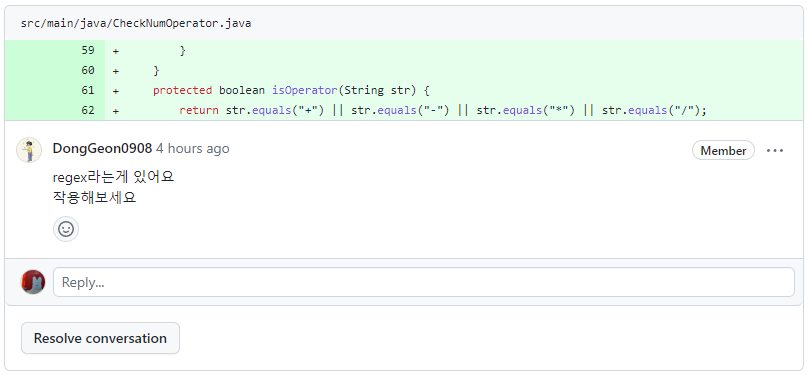

# 20230531



수정한 isOperator을 토대로 isNum또한 regex(정규표현식)을 토대로 구현

```java
protected boolean isNum(String number) {
        if (number.matches("^[0-9]+$"))
            return true;
        else return false;
    }
```
- 처음엔 number.equals로 비교했는데, equals로 비교할시 number 과 regex가 아닌 "^[0-9]+$"을 비교한다는 것을 깨달았다.

---

- 오늘자 calculator 시도
    - input number operator 값을 ArrayList로 시도했으나 CheckNumOperator 구현이 버거워 포기
    - number을 ArrayList로 시도중 ( 다시 실패 )

- 일급 컬렉션
    - 비즈니스에 종속적인 **자료구조**
    - [링크](https://dev-cool.tistory.com/28)를 참고하여 일급 컬렉션을 만들어보려 하였으나 실패…..

---


```java
protected boolean isNum(String number) {
        if (number.matches("^[0-9]+$"))
            return true;
        else return false;
    }
```

- 현재는 이렇게 사용중이다. 추후에 isNum이 NumberFormatException을 필요로 할때 로그를 추가해야할 것 같다.