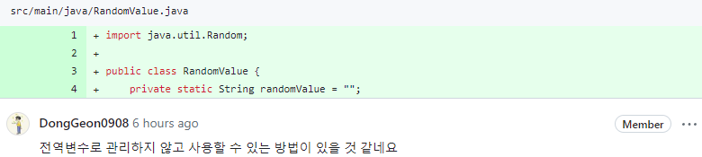

[GitHub - selab-hs/selab-baseball-game: SELAB 야구게임](https://github.com/selab-hs/selab-baseball-game)

Review 1. 

- 전역변수로 관리하지 않고 사용할 수 있는 방법이 있을 것 같네요

Ans : ~~static을 제거하고 final을 적용 한 후, PlayBaseball클래스에서 `generateRandomValue`를 호출해 사용~~  → Review3에서 수정

---

Review 2. 

- input class 처럼 output class를 분리하는게 좋을 듯 합니다.

Ans : `PrintResult`클래스 생성 및 분리

- **+**작업 도중에 `checkAnswer`도 합쳐서 `PrintResult` 클래스에서 결과 출력을 모두 담당하도록 할당하였다.

---

Review 3. 

- 변수로 할당에서 메모리에 저장해두고 쓰는게 아니라, 매 요청마다 새로운 값을 서빙만 하는 건 어떨지

Ans : PlayBaseball클래스에서 `generateRandomValue`를 호출해 사용

---
