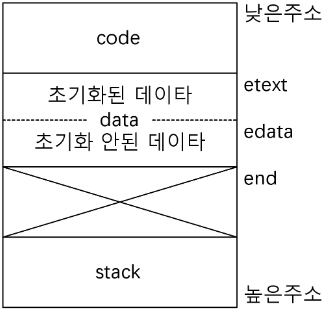

# 20230608

- [ ]  리눅스 부시기
- [ ]  소공 잘게 다지기

1. 프로세스를 생성하는 시스템 콜은 ( **`pid t_fork(void)`** )이다.
2. 리눅스에서 프로세스가 종료하는 원인은 두 가지인데 하나는 ( **`_exit()`** ) 시스템 콜 이고, 다른 하나는 ( **`시그널`** )의 수신이다.
3. 일정 시간이 경과하면 SIGALRM 시그널이 발생하도록 하는 시스템 콜은 ( **`alarm()`** )이다.
4. 특정 프로세스에게 시그널을 보내는 시스템 콜은 ( **`kill()`** )이다.
5. 자식 프로세스의 exit() 시스템 콜은 부모 프로세스의 ( **`wait()`** ) 시스템 콜에 영향을 준다.

1. 프로세스 이미지를 그리고 각 영역의 기능과 특성을 C언어로 작성된 프로그램과 관련지어 상세히 설명하시오.
    
    
    
2. 시그널이란 무엇인가를 설명하고, 시그널을 다루는 프로그램의 일반적인 구조와 동작을 설명하시오.
    
    **시그널 : 프로세스에게 발생하는 비동기적 사건**
    
    시그널 발생시 시그널 핸들러 수행 ex) `SIGINT, SIG_DFL, SIG_IGN`
    
3. 쉘은 화면에 프롬포트를 출력하고 대기하다가 키보드에서 명령이 입력되면 자식 프로세스를 생성하고, 자식 프로세스가 명령을 실행하도록 한다. 명령 수행이 완료되면 쉘은 다시 프롬프트를 출력하고 다음 명령을 기다린다. 이러한 기능을 수행하는 간단한 쉘을 C언어로 작성하시오.
    1. 입력값 : % ls
    2. 프롬프트 출력 시 prinf() 함수 사용
    3. 입력받을 때 fgets() 함수 사용
    4. 사용되는 시스템콜은 fork(), execvp((), wait(), exit()
        
        이 execvp()는 첫 번째 인수로  실행파일 이름만 주면 알아서 실행된다.
        
    5. 쉘을 종료할 때에는 ^D
    
    ```c
    char cmd[64];
    char *argv[16];
    
    while(1){
    	printf( "입력값 : ");
    	if(fgets(cmd,16,stdin) == NULL){
    		break;
    	} 
    	cmd[strlen(cmd)-1] = '\0';
      argv[0] = cmd;
      argv[1] = NULL;
      if (fork() == 0) { // child
    	  execvp(cmd, argv);
    	  exit(0);
    	}
    	wait(NULL);
    }
    ```
