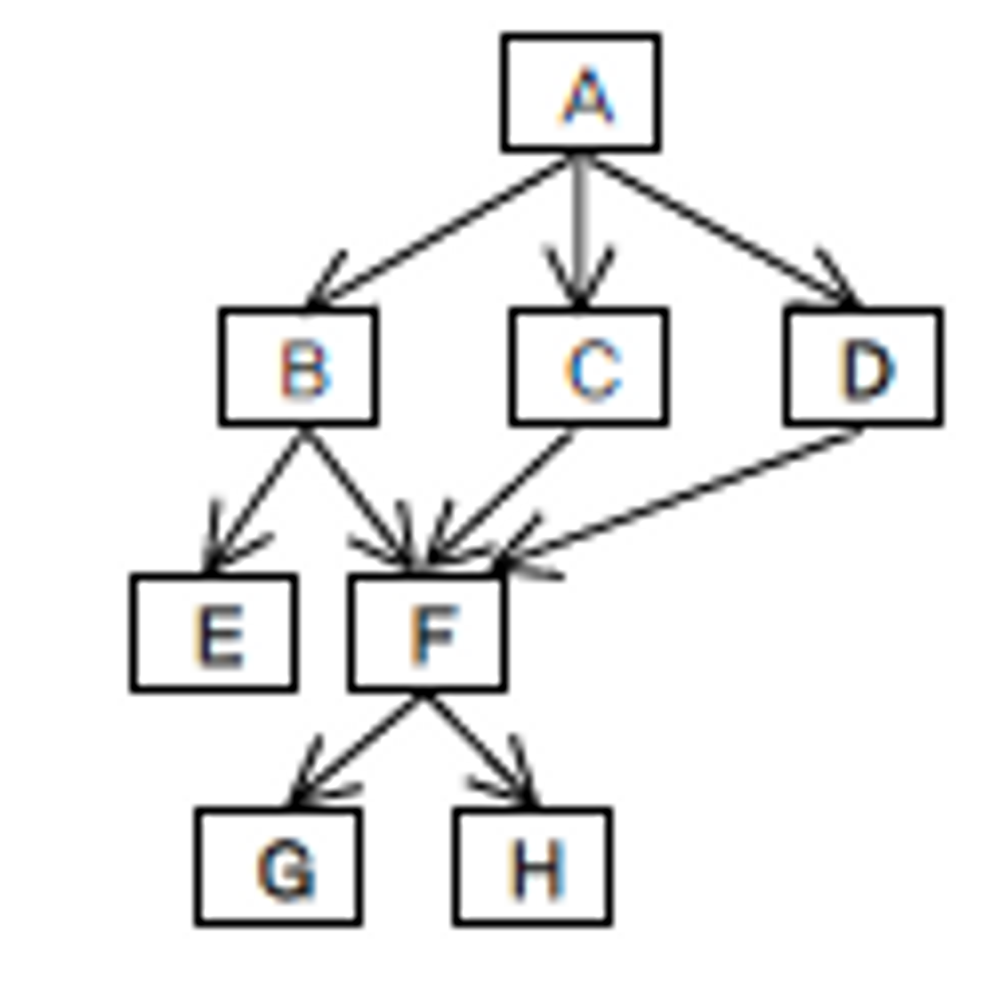

# 20230609

- [x]  소공 갈아마시기
- [ ]  리눅스 소화하기

---

### 9장

1. 소프트웨어 설계 대상
    - 아키텍쳐
        - 운영 환경 구조
        - 프로그램 구조
    - 모듈 - 컴포넌트
    - 데이터 - 자료 구조, 데이터베이스
    - 인터페이스, 시스템, 사용자

1. 모듈 설계
    - 하나의 시스템을 작은 요소로 나누어 재사용 가능하도록 설계하는 것
    - 프로그램의 제어구조, 자료구조, 인터페이스 및 알고리즘 구성

1. 설계 품질의 평가기준
    - 결합도, 응집도, 제어도, 공유도

1. 200라인의 프로그램을 50라인씩 5등분, 발생될 수 있는 모듈 응집도
    - 동시적 응집도

1. 모듈 설계 결합도 순서 ← 로 갈수록 모듈화 우수, 결합도 감소
    - data ← stamp ← control ← common ← content
    - 자료 ← 스탬프 ← 제어 ← 공통 ← 내용

응집도 순서 ← 로 갈수록 모듈화 우수, 응집력 증가

- function ← sequential ← communicational ← procedural ← temporal ←logical ← coincidental
- 기능적 ← 순차적 ← 통신적 ← 절차적 ← 시간적← 논리적 ← 우연적

1. 소프트웨어 아키텍처 표기법
    - 클래스 다이어그램, 개체관계도, 구조도

1. Fan-in, Fan-out



- 쉽게 말해 들어오는 갯수, 나가는 갯수
- F기준 Fan-in : 3, Fan-out : 2

1. 추상화
    - 절차 추상화(기능 추상화)
    - 자료 추상화
    - 제어 추상화

1. 추상화 설계
    
    상세한 것을 배제하고 주요 문제에만 집중하는 설계 방법
    
    - 절차 추상화 - 절차를 추상화, 의미있는 이름을 부여
    - 자료(data) 추상화 - Java(Class), C(Struct) 연관된 자료를 객체화
    - 제어 추상화 - 프로그램의 제어에 대한 효과만을 명세

1. 아키텍처 설계
    
    상위 수준 설계
    
    - 시스템 아키텍처 설계
    - 소프트웨어 아키텍처 설계
        - 구성 요소들의 구조적 관계 정의
    
    모듈 설계 - 하위 수준 설계
    
    - 컴포넌트 설계, 모듈에 대한 알고리즘 설계
    
2. fan-in : 특정 모듈을 직접 제어하는 다른 모듈 수
    
    fan-out : 특정 모듈이 직접 제어할 수 잇는 모듈 수
    

1. 기능적 응집도 : 모든 작업이 단일 기능 수행과 관련 -모듈화 더 강함
    
    순차적 응집도 : 하나의 작업 결과가 다른 작업으로 순차적 이동 - 모듈화 비교적 약함
    

1. 내용 결합도 : 한 모듈이 다른 모듈 내부를 언급하여 수정 or 이동
    
    자료 결합도 : 모듈 사이의 매개변수를 통해 필요한 자료만 교환
    
    모듈화 : 내용 > 자료 | 결합도 : 자료 > 내용
    
2. 설계에 대한 설명
    - 구현 플랫폼에 독립적인 논리적 모델 생성
    - 비기능 요구를 반영하는데 중점
    - 소프트웨어 요구 명세서(SRS) 이용
    
    분석에 대한 설명
    
    - 요구 만족을 위한 기술 솔루션에 중점
    - 문제 도메인에 대한 이해에 중점
    - 검증을 위해 사용자 포함

1. 논리적 모델 : 플랫폼 관계 X, 분석의 결과
    
    물리적 모델 : 플랫폼 관계 O, 설계의 결과
    

1. 분석
    - 검증을 위해 사용자 포함
    - 분석에서 생성되는 모델 : 논리적 모델

---

### 10장

1. 
    1. 응용처리
    2. 데이터관리
    3. 용이하고
    4. 적고
    5. 많다.
    
2. 얇은 클라이언트 구조
    
    2 -  소프트웨어 유지보수가 비교적 쉽다 ( 서버에 있기 때문 )
    
    4 - 네트워크에 부하가 비교적 크다. ( 서버와 교류가 잦음)
    
3. 2 클러스터 - 컴퓨터간 서버의 역할을 분산
4. 분산 객체 구조 장점 - 서로 다른 플랫폼에서 작성한 다른 언어로 작성된 객체 사이 통신 가능
    
    EX) CORBA
    
5. 1,5
6. 2

---

### 11장

1. 구조도가 표현하는 것 - 소프트웨어 구조

1. 구조적 기법에 사용되는 구조도에 대한 설명
    
    4,9,10
    
2. 2
3. 1←2→3→4→5,6
    
          2→7→8,9
    
4. 구조적 설계 방법
    - 변형 중심 설계, 거래 중심 설계
5. 구조도
    - 상위 계층 모듈 → 제어 모듈
    - 하위 계층 모듈 → 작업 모듈
6. 구조적 설계 방법 순서
    1. 구조도 초안 작성
    2. DFD 특성 파악
    3. 설계평가 기준에 의해 구조도 초안 개선
7. 


---

### 14장

1. 나사-슈나이더만 도표 3가지 제어구조
    - 반복, 분기, 순차
2. 모듈 설계도구
    - 분석 모델링 도구들은 보조 도구로 이용될 수 있다.
    - 활동 다이어그램은 흐름도와 유사한 표기법을 제공한다.
3. 프로그래밍 코드와 유사한 주요 키워드를 이용하여 서술적으로 명세하는 도구
    - PDL, Psudo code, Structured English
4. 


5. 3
6. 슈도코드 혹은 ( 의사코드 )라고 부르는 **PDL**은 모듈 설계를 위한 대표적인 텍스트 기반 표기법이다. 반면에 NS 도표와 ( 흐름도)는 모듈 설계를 위한 대표적인 그래픽 기반의 표기법이다. **PDL**은 구조적 프로그래밍 방법의 3가지 제어 구조인 ( 반복 ). ( 선택 ). ( 순차 )에 대한 표기를 지원한다.
7. 모듈 설계
    - 모듈에 대한 알고리즘을 정의한다.
    - 시스템이나 소프트웨어의 구성 요소들 사이의 관계를 정의한다.
    - 컴포넌트 설계라고 부른다.
8. 

```
Do until 파일끝
	Read 레코드
End do
```


