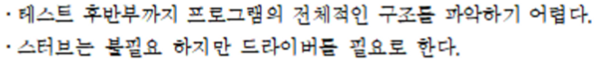

# 20230610

- [x]  소공 15 16 19
- [ ]  리눅스 다시 흝고 코드 정리

---

### 15장

- 단위 테스트 - 화이트박스 테스트
    - 단위 모듈이 모듈 설계에 따라 올바르게 구현되는지 확인하는 테스트
- 시스템 테스트 - 블랙박스 테스트
    - 기능, 비기능 요구를 만족하는지 확인,검증 하는 테스트

1. 4
2. 3
3. 2
4. 3
5. 4
6. 3
7. 테스트
    - 잠재적 오류를 발견하기 위함.
    - 테스트는 SQA가 수행
    - 하향식 X 상향식 포함
8. 3 - 2개 골라야하는데 답이 하나밖에 없다.

1. 회귀 테스트
2. 😭
3. 시스템 테스트 - 요구 명세의 기능/비기능 요구를 만족하는지 검사하는 테스트
    
    단위 테스트 - 모듈 설계에 따라 올바르게 구현되었는지 검사하는 테스트
    
4. 

1) M1은 드라이버의 역할을 하고 M2,M3는 (     ①    )로 대체한다.

2)  M1,M2를 통합하고 M4는 (    ②      )로 대체한 후 (     ③     ) 테스트를 수행한다.

3)  (        ④          )를 통합하고 (      ⑤        ) 테스트를 수행한다.

4)  (        ⑥          )를 통합하고 (       ⑦       ) 테스트를 수행한다.

① 스터브 ② 스터브 ③ 단위 ④ M2,M4 ⑤ 통합 ⑥M1,M3 ⑦  통합

1. 
    1. 파레토 원리(pareto)
    2. SQA
    3. 정형화된 방법 = 인스펙션
        
        비정형화된 방법 = 워크 스루
        
    4. 순환적 복잡도, 기초경로 테스트
    5. 모듈설계, 단위 테스트
    6. 베타 테스트

1. 
2. 데이터 흐름도, 변경 테스트, 블랙박스 테스트, 동등분할 테스트
3. 

---

### 16장

1. 4
2. 4
3. 2
4. 재공학 - 시스템의 동일 추상화 수준에서 다른 표현으로 변형하는 것
5. 시스템 이해, 회귀 시험
6. 역공학, 회귀 테스트
7. 적응, 예방, 완전, 정정
    1. **정정 유지보수** : 사용자 테스트 혹은 내부 테스트를 통해 발견된 오류를 올바르게 고치기 위해 수정하는 유지보수
    2. **적응 유지보수** : 하드웨어나 소프트웨어의 환경 변화에 따라 소프트웨어 제품을 계속 사용하기위해 수정하는 유지보수 ( 새로운 기능 추가 X)
    3. **완전 유지보수** :  사용자에 의한 새로운 비기능 요구 or 기능 추가에 의해 수정하는 유지보수
    4. **예방 유지보수** : 문제가 발생하기 전 예방하기 위한 목적으로 수행하는 유지보수
        - 잠재적인 오류 예방을 위해 개조하는 유지보수 ( 오류 X 환경변화 X  )
8. 4, 3, 1, 3, **`1`, `1`**, 4, **`2`**
9. **환경 변화에 따라** - 적응 유지보수
10. 1순위 - 시스템 이해
11. 요구 파악? | 예방 유지보수?
12. 무결성

---

### 19장

단계 → 성숙, 연속 → 능력

## 단계적 표현 방법

- 성숙 단계 1 to 5

|  | 프로세스 관리 체계 | 프로세스 정의 | 정량적 관리 | 최적화 |
| --- | --- | --- | --- | --- |
| 단계1 | X | X | X | X |
| 단계2 | O | X | X | X |
| 단계3 | O | O | X | X |
| 단계4 | O | O | O | X |
| 단계5 | O | O | O | O |

성숙 단계 1 : 초기 → 성숙 단계 2 : 관리됨 → 성숙 단계 3 : 정의됨

→ 성숙 단계 4 : 정량적 관리됨 → 성숙 단계 5 : 최적화됨

## 연속적 표현 방법

- 능력 단계 1 to 4

|  | 프로세스 관리 체계 | 프랙티스 수행 | 정의됨 | 정량적 관리 |
| --- | --- | --- | --- | --- |
| 단계1 | X | X | X | X |
| 단계2 | O | X | X | X |
| 단계3 | O | O | X | X |
| 단계4 | O | O | O | X |

능력 단계 1 : 초기 → 능력 단계 2 : 수행됨→ 능력 단계 3 : 정의됨

→ 능력 단계 4 : 정량적 관리됨

## SPICE 모델 구조

- **연속적 표현 방법**과 **동일 구조** (단계가 하나 더 있음!)
- **CMMI** 모델은 **SPICE** 모델 구조를 포함하고 있는 **통합** 모델

|  | 프로세스 |
| --- | --- |
| 단계1 | 불완전 프로세스 |
| 단계2 | 수행 프로세스 |
| 단계3 | 관리 프로세스 |
| 단계4 | 수립 프로세스 |
| 단계5 | 최적화 프로세스 |

1. 4 SPICE 는 연속적 표현 방법 (능력 단계)
2. 5,1,3,2,4
3. Capability Maturity Model Integration
4. 사용자들이 CMMI 모델 적용을 원함
    
    구체적인 방법을 제시해줌
    
5. CMMI 관리됨 vs 정의됨
    
    성숙 단계 2 관리됨 → 프로세스 관리 체계는 적용되어있으나 정의가 되어있지않다.
    
    성숙 단계 3 정의됨 → 프로세스 관리 체계는 적용되어있으며 정의가 되어있다.
    
6. 프로세스 영역 : 각 단계별로 수행되는 특정 작업을 통틀어 칭하는 말
