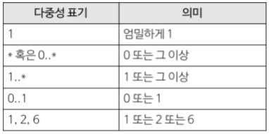

### 구조 다이어그램

- 시스템의 **정적 구조** 표현
- 시스템 아키텍처, 소프트웨어 아키텍처 표현

### 클래스 다이어그램

- **객체**와 객체의 **속성**과 **연산**, 객체 사이의 **관계**를 모델링하기 위한 **그래픽 표기법** 제공
- 소프트웨어 **구조** 표현

---

### 속성 표기법

> **가시성** 이름: 타입 **[다중성]** = 초기값 **{제약조건}**
> 

| 가시성 |  | 다중성 [] |  |
| --- | --- | --- | --- |
| public | + | [1] | 엄밀하게 1 |
| protected | # | [1..5] | 1 또는 5 |
| package | ~ | [*] == [0..*] | 0개 이상의 객체 |
| private | - | [1..*] | 1개 이상의 객체 |



**EX)**

- `age: int`      가시성 : 미정, 정수(int)값 포함 가능
- `time: Date`   가시성 : 미정, Date 객체 포함 가능
- `+cars: Car[*]` 가시성 : public, 0개 이상의 Car 객체 포함 가능
- `-curve: Point[2..*]`  가시성 : private, 2개 이상의 Point 객체 포함 가능
- `-finished: Boolean = true {readOnly}` 가시성 : private, 초기값은 true 이며 수정 불가.
- `+ isLarge(first: Circle, second: Circle) : Boolean`
    - == `public boolean isLarge(Circle circle1, Circle circle2)`

---

### 클래스 표기법

`: 고용인` ’고용인’ 클래스의 특정 인스턴스 객체 (이름 명세 X)

`홍길동 : 고용인` ’고용인’ 클래스의 ‘홍길동’ 객체

| 홍길동 : 고용인 |
| --- |
| 이름 = 홍길동
부서 = 사무처 |

‘고용인’ 클래스의 ‘홍길동’ 객체의 이름은 ‘홍길동’이고, 부서는 ‘사무처’

### 클래스 표기법 자바 코드

<br>

| 고용인 |
| --- |
| 이름: string
부서: string |
| + 임금계산(보너스: int) : double |

```java
class Employer{
	private String name;
	private String dept;
	public double computeSalary(int bonus){}
}
```

<br>

| 홍길동 : 고용인 |
| --- |
| 이름 = 홍길동
부서 = 사무처 |

```java
void main(){
	Employer 홍길동 = new Employer
					("홍길동", "사무처");
}
```
<br>

---

### 관계

1. 일반화 (generalization)


클래스 사이의 일반화(상속) 관계를 표현하며 ‘이다(is-a)', ‘종류이다(kind-of)’로 해석한다.

<br>

2. 연관 (association)


클래스 사이의 일반적인 관계를 표현하며 ‘관련되다(related-to)’, 안다’(know-about)’로 해석한다.

<br>

3. 집합 (aggregation)


연관 관계의 특별한 형태
’전체와 부분(whole-part)’,  ‘포함하다(contains)`, ‘구성하다(consists-of)’, ‘부분이다(part-of)’

<br>

4. 복합 (composition)


연관 관계의 특별한 형태
집합 관계와 동일한 해석

<br>

5. 실현 (realization)


특정 클래스의 명세를 구현하는 관계

<br>

6. 의존 (dependency)


특정 클래스의 명세나 구현의 변화가 다른 클래스에 영향을 미치는 관계
‘이용하다(use)’

<br>

### 연관관계 표기법

### 연관관계 - 자바코드

`선수` - `팀`
```java
class Player{
	Team t;
}
class Team{
	Player p;
}
```


```java
class Player {
	Team employer;
}
class Team

}
```


```java
class Player {
	Team employer;
}
class Team {
	Collection<Player> employee;
}
```

### 의존 관계 vs 연관 관계

```java
//의존
class A {
	void opA(B b){
		b.opB();
	}
}

class B {
	void opB();
}

//연관
class A{
B b = new B();
	void opA() {
		b.opB();
	}
}

class B {
	void opB();
}
```

- 연관 관계 - **지속적인** 관계, 클래스 구조에 영향O
- 의존 관계 - **일시적인** 관계, 클래스 구조에 영향X
