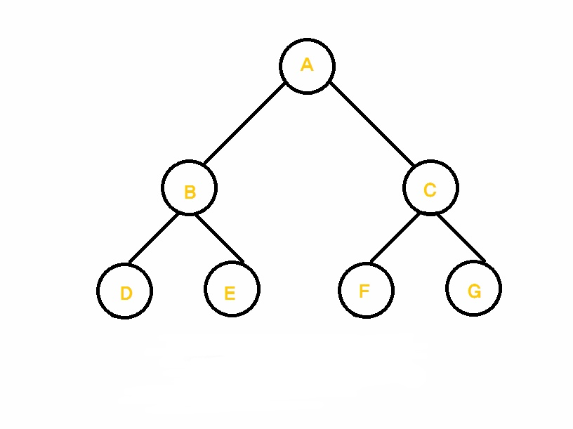

https://www.youtube.com/watch?v=b4pD7-pcbbo&list=PLniy99c_7ZfpURYCmquts3lQYWzFAIxod

## 전위, 중위, 후위, 순회

### 전위 순회

- 부모 노드부터 시작, A B D E C F G

### 중위 순회

- 왼쪽 자식 노드를 모두 방문 후에 부모를 방문 후, 오른쪽 자식 노드 방문 D B E A F C G

### 후위 순회

- 자식 노드를 왼쪽 부터 최우선으로 방문 후, 부모를 후위로 방문 D E B F G C A
